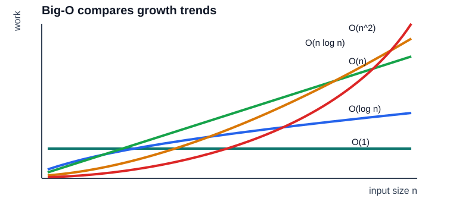

# 01. 复杂度入门

复杂度回答的是：当输入规模 `n` 变大时，程序运行时间或内存占用如何增长。

它不是精确计时工具，而是增长趋势工具。`100n` 和 `n` 都是 `O(n)`，因为当 `n` 足够大时，常数项不改变增长等级。



## 常见复杂度

| 复杂度 | 直觉 | 例子 |
| --- | --- | --- |
| `O(1)` | 输入变大，步骤数基本不变 | 数组按下标访问 |
| `O(log n)` | 每次排除一半 | 二分查找 |
| `O(n)` | 每个元素看一遍 | 求和、线性搜索 |
| `O(n log n)` | 每层处理 `n` 个元素，共 `log n` 层 | 归并排序 |
| `O(n^2)` | 两层循环配对 | 冒泡排序、所有二元组合 |

## 如何分析代码

1. 找出和输入规模有关的循环。
2. 看循环之间是并列还是嵌套。
3. 去掉常数、低阶项。
4. 注意隐藏成本，例如 `vector.insert(begin)` 会移动很多元素。

```cpp
for (int x : values) {
    sum += x;
}
```

每个元素访问一次，所以是 `O(n)`。

```cpp
for (int i = 0; i < n; ++i) {
    for (int j = i + 1; j < n; ++j) {
        // ...
    }
}
```

大约执行 `n * (n - 1) / 2` 次，所以是 `O(n^2)`。

## 本章实验

运行：

```powershell
.\build\debug\bin\01_complexity.exe
```

你会看到同样把输入扩大 4 倍，线性算法和平方算法的耗时增长完全不同。实际数字会受机器、编译器和 Debug/Release 模式影响，但增长趋势更重要。

## 调试建议

在 `quadratic_pair_count` 的内层循环打断点，观察 `i` 和 `j` 如何组成所有不重复二元组合。
