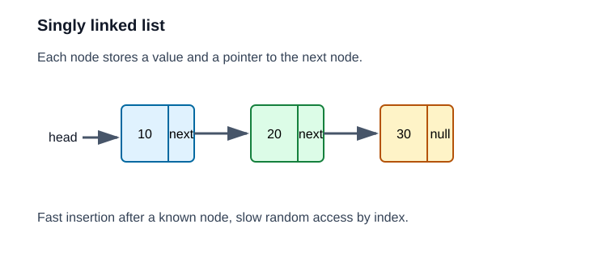

# 03. 链表

链表把元素放在一个个节点里，每个节点保存值和指向下一个节点的指针。



```text
head -> [value|next] -> [value|next] -> [value|null]
```

## 核心性质

- 不能按下标快速访问：查找第 `i` 个元素需要从头走，`O(n)`。
- 已知位置后插入或删除可以是 `O(1)`。
- 每个节点额外保存指针，有额外内存开销。
- 节点分散在内存中，遍历时通常不如数组缓存友好。

## 代码观察点

看 [include/ds/linked_list.hpp](../include/ds/linked_list.hpp)：

- `push_front`：改 `head`。
- `push_back`：因为维护了 `tail`，所以尾插是 `O(1)`。
- `remove_first`：需要找到目标节点和它的前驱。
- `reverse`：用三个指针原地反转链表。

## 反转链表的指针变化

反转链表时最容易丢节点。每一步都要先保存 `next`：

```text
next = cur->next
cur->next = prev
prev = cur
cur = next
```

顺序错了，就可能再也找不到后面的链。

## 本章实验

运行：

```powershell
.\build\debug\bin\03_linked_list.exe
```

建议在 `reverse` 函数里单步调试，观察 `prev`、`cur`、`next` 三个变量。
