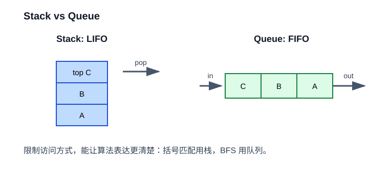

# 04. 栈与队列

栈和队列不是“更复杂的数组”，而是限制访问方式后的抽象。



## 栈：后进先出

栈只允许操作栈顶：

- `push`：入栈。
- `pop`：出栈。
- `top`：查看栈顶。

典型应用：

- 括号匹配。
- 函数调用栈。
- 表达式求值。
- DFS 的非递归写法。
- 撤销操作。

## 队列：先进先出

队列只允许从尾部进入、从头部出去：

- `push`：入队。
- `pop`：出队。
- `front`：查看队首。

典型应用：

- 打印任务。
- 消息队列。
- BFS。
- 生产者消费者模型。

## 循环队列

普通数组做队列时，如果每次出队都移动元素，会很浪费。循环队列用 `head` 和 `tail` 在数组里绕圈移动。

为了区分空和满，本仓库的 `CircularQueue` 多留一个空位置：

- `head == tail` 表示空。
- `next(tail) == head` 表示满。

## 本章实验

运行：

```powershell
.\build\debug\bin\04_stack_queue.exe
```

建议：

- 给 `is_balanced` 添加更多括号字符串。
- 把队列初始容量改成 1，观察自动扩容是否正常。
