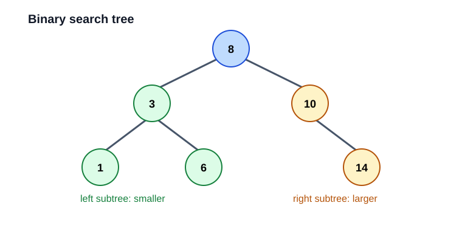
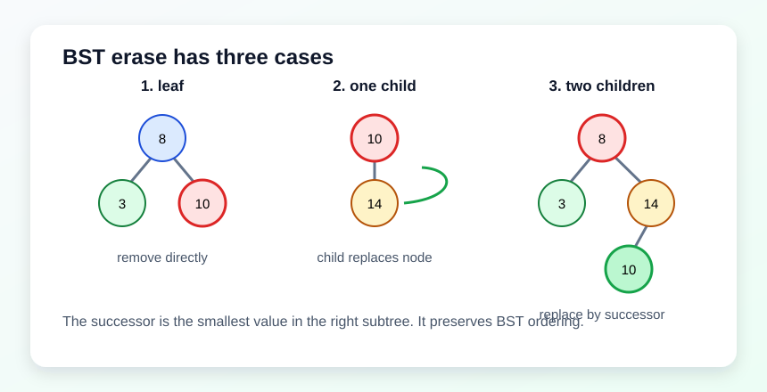

# 06. 二叉搜索树

树是一种层次结构。二叉搜索树（BST）在二叉树基础上增加搜索规则：



- 左子树所有值小于当前节点。
- 右子树所有值大于当前节点。
- 每个子树也满足同样规则。

## 为什么中序遍历是有序的

中序遍历顺序是：

1. 左子树。
2. 当前节点。
3. 右子树。

因为 BST 左边都小，右边都大，所以中序遍历会得到升序结果。

## 复杂度

如果树比较平衡，高度约为 `log n`，查找、插入、删除平均 `O(log n)`。

如果按有序数据插入，例如 `1, 2, 3, 4, 5`，树会退化成链表，高度变成 `n`，操作最坏 `O(n)`。

## 删除节点的三种情况

1. 叶子节点：直接删除。
2. 只有一个孩子：让孩子接替它。
3. 有两个孩子：用右子树最小节点，也叫后继节点，替换当前值，再删除后继节点。



## 本章实验

运行：

```powershell
.\build\debug\bin\06_tree.exe
```

建议把插入顺序改成 `1, 2, 3, 4, 5, 6`，再观察 `height`。
