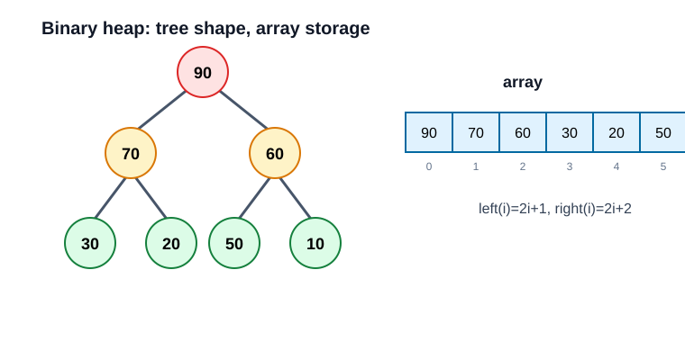

# 07. 堆与优先级队列

堆是一棵满足局部有序关系的完全二叉树。最大堆保证每个父节点都不小于子节点，因此堆顶是最大值。



堆通常用数组存储：

```text
parent(i) = (i - 1) / 2
left(i)   = 2 * i + 1
right(i)  = 2 * i + 2
```

## 核心操作

- `push`：新元素放到数组末尾，然后向上调整，`O(log n)`。
- `pop`：取走堆顶，用最后一个元素补到堆顶，然后向下调整，`O(log n)`。
- `top`：查看堆顶，`O(1)`。

## 堆不是完全排序

堆只保证父节点优先级高于孩子，不保证左右孩子之间、不同子树之间有全局顺序。

这就是为什么堆适合“每次取最大/最小”，但不适合按顺序遍历所有元素。

## 本章实验

运行：

```powershell
.\build\debug\bin\07_heap_priority_queue.exe
```

建议在 `sift_up` 和 `sift_down` 打断点，看元素如何交换。
