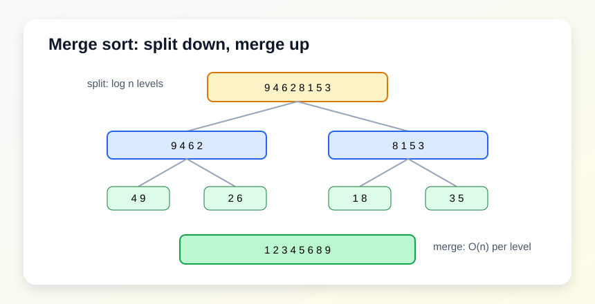

# 09. 排序算法

排序是理解算法设计思想的好入口。本章实现三种常见排序。


## 插入排序

思想：左侧维护一个有序区，把新元素插入到合适位置。

- 最好：`O(n)`，数据已经基本有序。
- 平均/最坏：`O(n^2)`。
- 原地排序。
- 稳定。

## 快速排序

思想：选一个 pivot，把小的放左边，大的放右边，再递归处理左右两边。

- 平均：`O(n log n)`。
- 最坏：`O(n^2)`。
- 原地排序。
- 通常很快，但需要注意 pivot 选择。

## 归并排序

思想：先分成两半分别排好，再合并两个有序序列。

- 稳定 `O(n log n)`。
- 需要额外空间。
- 非常适合链表排序和外部排序思想。



## 本章实验

运行：

```powershell
.\build\debug\bin\09_sorting.exe
```

建议：

- 输入已经有序的数据。
- 输入全部相等的数据。
- 用自定义比较器按字符串长度排序。
