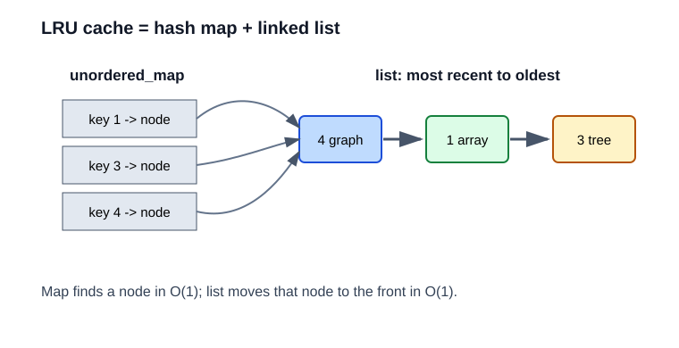

# 10. 综合项目：LRU 缓存

LRU 是 Least Recently Used，意思是当容量满时，淘汰最久没有被使用的元素。



常见场景：

- 浏览器缓存。
- 数据库页缓存。
- 图片或接口结果缓存。

## 需求

我们希望：

- `get(key)`：如果存在，返回值，并把它变成最近使用。
- `put(key, value)`：插入或更新，并把它变成最近使用。
- 超过容量时，删除最久未使用的元素。
- `get` 和 `put` 平均都是 `O(1)`。

## 结构组合

单独用哈希表：

- 能 `O(1)` 找 key。
- 但不知道谁最久没用。

单独用链表：

- 能维护从最近到最旧的顺序。
- 但查找 key 是 `O(n)`。

组合：

- `unordered_map<Key, list iterator>` 快速定位节点。
- `list<pair<Key, Value>>` 维护使用顺序。
- 每次访问，把节点 splice 到链表头部。

## 本章实验

运行：

```powershell
.\build\debug\bin\10_integrated_lru.exe
```

观察 key `2` 为什么被淘汰：

1. 插入 1、2、3。
2. 访问 1，所以 1 变成最近使用。
3. 插入 4，容量超过 3。
4. 此时 2 最久没用，所以被删除。
