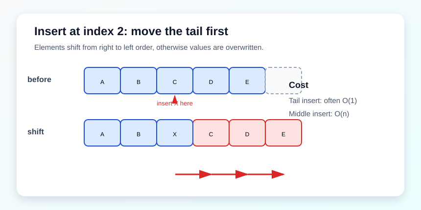

# 数组 / 前缀和 / 双指针

这一组题主要练三件事：

1. 连续内存上的原地操作。
2. 两端夹逼的双指针。
3. 前缀和把区间问题转成“到这里为止统计过什么”。



## 26. Remove Duplicates from Sorted Array

题目描述：给定一个非降序数组，原地删除重复元素，使每个元素只出现一次，并返回新的长度。

示意：`[1,1,2,2,3] -> [1,2,3]`

关键点：数组是有序的，所以重复元素一定相邻。你不需要哈希表，只要比较相邻元素即可。

思路：慢指针 `slow` 维护“下一个不同元素应该放的位置”，快指针 `fast` 扫描全数组。遇到新值就写入。

复杂度：时间 `O(n)`，空间 `O(1)`。

```cpp
class Solution {
public:
    int removeDuplicates(vector<int>& nums) {
        if (nums.empty()) return 0;
        int slow = 1;
        for (int fast = 1; fast < (int)nums.size(); ++fast) {
            if (nums[fast] != nums[fast - 1]) {
                nums[slow++] = nums[fast];
            }
        }
        return slow;
    }
};
```

## 283. Move Zeroes

题目描述：把数组中的所有 0 移到末尾，同时保持非零元素的相对顺序不变。

示意：`[1,0,3,0,12] -> [1,3,12,0,0]`

关键点：你只能在原数组里操作，所以最自然的做法是用双指针把非零元素往前搬。

思路：`slow` 记录当前该放非零元素的位置。`fast` 扫描时遇到非零就交换到前面。这个写法比“先收集再补 0”更直接。

复杂度：时间 `O(n)`，空间 `O(1)`。

```cpp
class Solution {
public:
    void moveZeroes(vector<int>& nums) {
        int slow = 0;
        for (int fast = 0; fast < (int)nums.size(); ++fast) {
            if (nums[fast] != 0) {
                swap(nums[slow++], nums[fast]);
            }
        }
    }
};
```

## 189. Rotate Array

题目描述：将数组中的元素向右轮转 `k` 个位置。

示意：`[1,2,3,4,5,6,7], k=3 -> [5,6,7,1,2,3,4]`

关键点：旋转不是重新开数组的唯一做法，三次反转可以在原地完成。

思路：经典三次反转。先整体反转，再反转前 `k` 个和后 `n-k` 个，就能把尾部元素转到前面。

复杂度：时间 `O(n)`，空间 `O(1)`。

```cpp
class Solution {
public:
    void rotate(vector<int>& nums, int k) {
        int n = (int)nums.size();
        k %= n;
        reverse(nums.begin(), nums.end());
        reverse(nums.begin(), nums.begin() + k);
        reverse(nums.begin() + k, nums.end());
    }
};
```

## 238. Product of Array Except Self

题目描述：返回一个数组，其中第 `i` 个位置的值等于原数组中除 `nums[i]` 之外所有元素的乘积，不能使用除法。

示意：`[1,2,3,4] -> [24,12,8,6]`

关键点：把“左边乘积”和“右边乘积”拆开，分别累乘，就能避免除法和嵌套循环。

思路：两趟扫描。第一趟算前缀积，第二趟从右往左乘后缀积。`res[i]` 先存左边乘积，再乘右边乘积。

复杂度：时间 `O(n)`，空间 `O(1)` 额外空间（不算答案数组）。

```cpp
class Solution {
public:
    vector<int> productExceptSelf(vector<int>& nums) {
        int n = (int)nums.size();
        vector<int> res(n, 1);
        int left = 1;
        for (int i = 0; i < n; ++i) {
            res[i] = left;
            left *= nums[i];
        }
        int right = 1;
        for (int i = n - 1; i >= 0; --i) {
            res[i] *= right;
            right *= nums[i];
        }
        return res;
    }
};
```

## 11. Container With Most Water

题目描述：给定一组竖线，找两条线和 x 轴围成的最大面积。

示意：两端夹逼，面积由较短边决定。

关键点：面积由较短边决定，所以移动较短边才可能得到更优解。

思路：双指针从两边往中间走。面积受较短边限制，所以每次移动较短的一边才有机会变大。

复杂度：时间 `O(n)`，空间 `O(1)`。

```cpp
class Solution {
public:
    int maxArea(vector<int>& height) {
        int l = 0, r = (int)height.size() - 1;
        int ans = 0;
        while (l < r) {
            ans = max(ans, min(height[l], height[r]) * (r - l));
            if (height[l] < height[r]) ++l;
            else --r;
        }
        return ans;
    }
};
```
