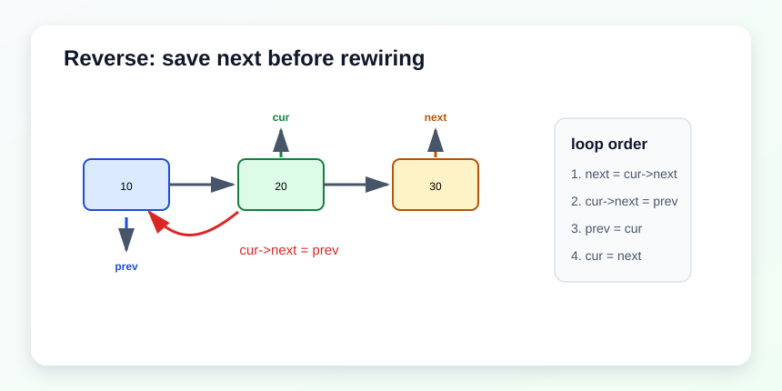

# 链表

链表题重点练三件事：

1. 指针重连，不要丢链。
2. 虚拟头结点，简化删除和插入。
3. 快慢指针，处理环和中点。



## 通用定义

```cpp
struct ListNode {
    int val;
    ListNode* next;
    ListNode(int x) : val(x), next(nullptr) {}
};
```

## 206. Reverse Linked List

题目描述：将单链表反转，并返回新的头结点。

示意：`head -> A -> B -> C -> null` 变成 `null <- A <- B <- C`

关键点：反转时最容易丢链，所以每次改 `next` 之前必须先保存后继节点。

思路：三个指针 `prev / cur / next`，每次先保存后继，再改指向。

复杂度：时间 `O(n)`，空间 `O(1)`。

```cpp
class Solution {
public:
    ListNode* reverseList(ListNode* head) {
        ListNode* prev = nullptr;
        ListNode* cur = head;
        while (cur) {
            ListNode* next = cur->next;
            cur->next = prev;
            prev = cur;
            cur = next;
        }
        return prev;
    }
};
```

## 21. Merge Two Sorted Lists

题目描述：把两个升序链表合并成一个新的升序链表。

示意：`1->2->4` 和 `1->3->4` 合成 `1->1->2->3->4->4`

关键点：虚拟头结点能把“第一个节点怎么接”这个特殊情况消掉。

思路：用虚拟头结点做结果链表的起点，比较两个当前节点，把较小者接到尾部。

复杂度：时间 `O(m+n)`，空间 `O(1)`。

```cpp
class Solution {
public:
    ListNode* mergeTwoLists(ListNode* list1, ListNode* list2) {
        ListNode dummy(0), *tail = &dummy;
        while (list1 && list2) {
            if (list1->val < list2->val) {
                tail->next = list1;
                list1 = list1->next;
            } else {
                tail->next = list2;
                list2 = list2->next;
            }
            tail = tail->next;
        }
        tail->next = list1 ? list1 : list2;
        return dummy.next;
    }
};
```

## 19. Remove Nth Node From End of List

题目描述：删除链表中倒数第 `n` 个节点。

示意：快指针和慢指针保持 `n` 个节点间隔。

关键点：不要先数长度再删除。快慢指针能一趟完成。

思路：快指针先走 `n` 步，再让快慢指针一起走。快指针到尾时，慢指针正好停在待删节点前面。

复杂度：时间 `O(n)`，空间 `O(1)`。

```cpp
class Solution {
public:
    ListNode* removeNthFromEnd(ListNode* head, int n) {
        ListNode dummy(0, head);
        ListNode* fast = &dummy;
        ListNode* slow = &dummy;
        while (n--) fast = fast->next;
        while (fast->next) {
            fast = fast->next;
            slow = slow->next;
        }
        ListNode* del = slow->next;
        slow->next = del->next;
        return dummy.next;
    }
};
```

## 141. Linked List Cycle

题目描述：判断单链表是否存在环。

示意：`A -> B -> C -> D -> B`

关键点：如果有环，快慢指针一定会在环里相遇。

思路：快慢指针。慢指针一次一步，快指针一次两步。如果有环，两者一定会相遇。

复杂度：时间 `O(n)`，空间 `O(1)`。

```cpp
class Solution {
public:
    bool hasCycle(ListNode *head) {
        ListNode *slow = head, *fast = head;
        while (fast && fast->next) {
            slow = slow->next;
            fast = fast->next->next;
            if (slow == fast) return true;
        }
        return false;
    }
};
```

## 142. Linked List Cycle II

题目描述：如果链表有环，返回环的入口节点；否则返回空。

示意：相遇点不一定是入口，但从头和从相遇点一起走会在入口重合。

关键点：相遇不代表入口。相遇点到入口的距离和头结点到入口的距离存在可推导关系。

思路：相遇后，把一个指针放回头结点，再让两个指针每次都走一步；再次相遇点就是入口。

复杂度：时间 `O(n)`，空间 `O(1)`。

```cpp
class Solution {
public:
    ListNode *detectCycle(ListNode *head) {
        ListNode *slow = head, *fast = head;
        while (fast && fast->next) {
            slow = slow->next;
            fast = fast->next->next;
            if (slow == fast) {
                ListNode* p1 = head;
                ListNode* p2 = slow;
                while (p1 != p2) {
                    p1 = p1->next;
                    p2 = p2->next;
                }
                return p1;
            }
        }
        return nullptr;
    }
};
```
