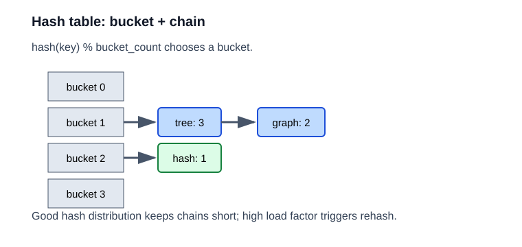

# 哈希表

哈希表题的核心不是“记住 unordered_map 的用法”，而是学会：

1. 用 key 直达答案。
2. 通过计数、索引、前缀状态做去重和统计。



## 1. Two Sum

题目描述：给定一个整数数组和目标值 target，找出两个数，使它们的和等于 target，返回它们的下标。

示意：`[2,7,11,15], target=9 -> [0,1]`

关键点：你不需要枚举所有二元组。扫描到当前位置时，先问“之前有没有人需要我这个数作为补数”。

思路：一边扫数组，一边把“我想找的另一个数”放进哈希表。当前值如果正好被需要过，就返回答案。

复杂度：时间 `O(n)`，空间 `O(n)`。

```cpp
class Solution {
public:
    vector<int> twoSum(vector<int>& nums, int target) {
        unordered_map<int, int> pos;
        for (int i = 0; i < (int)nums.size(); ++i) {
            int need = target - nums[i];
            if (pos.count(need)) return {pos[need], i};
            pos[nums[i]] = i;
        }
        return {};
    }
};
```

## 242. Valid Anagram

题目描述：判断两个字符串是否由相同的字符组成，且每个字符出现次数也相同。

示意：`anagram` 和 `nagaram` 是一组，`rat` 和 `car` 不是。

关键点：字符种类少时，计数比排序更直接。

思路：统计字符频次。最简单就是开一个 26 大小的计数数组。

复杂度：时间 `O(n)`，空间 `O(1)`。

```cpp
class Solution {
public:
    bool isAnagram(string s, string t) {
        if (s.size() != t.size()) return false;
        int cnt[26] = {};
        for (char c : s) ++cnt[c - 'a'];
        for (char c : t) if (--cnt[c - 'a'] < 0) return false;
        return true;
    }
};
```

## 49. Group Anagrams

题目描述：把一组字符串按字母异位词分组，输出每组中的字符串集合。

示意：`eat tea ate` 同组，`tan nat` 同组，`bat` 单独一组。

关键点：字母异位词有相同的“字符组成特征”，所以能映射到同一个哈希 key。

思路：排序后的字符串作为 key。相同 key 的单词自然属于一组。

复杂度：时间 `O(n * k log k)`，其中 `k` 是单词长度。

```cpp
class Solution {
public:
    vector<vector<string>> groupAnagrams(vector<string>& strs) {
        unordered_map<string, vector<string>> mp;
        for (auto s : strs) {
            string key = s;
            sort(key.begin(), key.end());
            mp[key].push_back(s);
        }
        vector<vector<string>> ans;
        for (auto& [k, v] : mp) ans.push_back(move(v));
        return ans;
    }
};
```

## 128. Longest Consecutive Sequence

题目描述：给定一个无序整数数组，返回其中最长连续整数序列的长度。

示意：`[100,4,200,1,3,2] -> 4`，对应 `1,2,3,4`。

关键点：不能每个数都向两边扩展，否则会重复很多次。只从“序列起点”开始扫才是线性思路。

思路：把所有数放入哈希集合。只从“序列起点”开始往后扩展，避免重复扫描。

复杂度：平均 `O(n)`。

```cpp
class Solution {
public:
    int longestConsecutive(vector<int>& nums) {
        unordered_set<int> st(nums.begin(), nums.end());
        int ans = 0;
        for (int x : st) {
            if (!st.count(x - 1)) {
                int y = x;
                while (st.count(y)) ++y;
                ans = max(ans, y - x);
            }
        }
        return ans;
    }
};
```

## 560. Subarray Sum Equals K

题目描述：给定整数数组和整数 k，求和等于 k 的连续子数组个数。

示意：前缀和差值 `sum[r] - sum[l-1] = k`

关键点：连续子数组和可以转化成两个前缀和的差。

思路：前缀和 + 哈希表。假设当前前缀和为 `sum`，那么之前出现过多少次 `sum - k`，就说明有多少个区间以当前位置结尾且和为 k。

复杂度：时间 `O(n)`，空间 `O(n)`。

```cpp
class Solution {
public:
    int subarraySum(vector<int>& nums, int k) {
        unordered_map<int, int> cnt;
        cnt[0] = 1;
        int sum = 0, ans = 0;
        for (int x : nums) {
            sum += x;
            if (cnt.count(sum - k)) ans += cnt[sum - k];
            ++cnt[sum];
        }
        return ans;
    }
};
```
