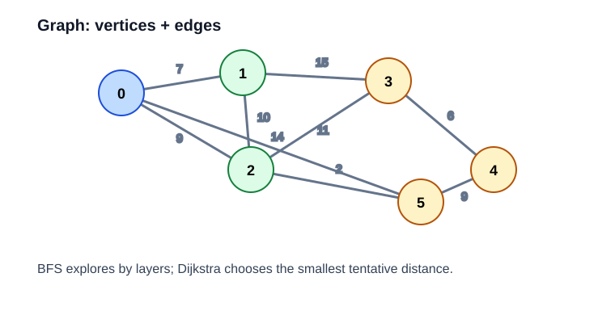

# 图

图题重点训练：

1. BFS 和 DFS 的模板。
2. 最短路与拓扑排序。
3. 图论题里状态的建模。



## 200. Number of Islands

题目描述：给定一个二维网格，其中 1 表示陆地、0 表示水，统计岛屿的数量。

示意：一整片连着的 `1` 算一个岛。

关键点：每个岛屿其实就是一个连通分量。

思路：把每块陆地当作一个连通分量，DFS 或 BFS 走完一整块后，计数加一。

复杂度：时间 `O(mn)`。

```cpp
class Solution {
public:
    int numIslands(vector<vector<char>>& grid) {
        int m = grid.size(), n = grid[0].size(), ans = 0;
        vector<int> dx{1,-1,0,0}, dy{0,0,1,-1};
        function<void(int,int)> dfs = [&](int x, int y) {
            grid[x][y] = '0';
            for (int d = 0; d < 4; ++d) {
                int nx = x + dx[d], ny = y + dy[d];
                if (nx>=0 && nx<m && ny>=0 && ny<n && grid[nx][ny]=='1') dfs(nx, ny);
            }
        };
        for (int i = 0; i < m; ++i)
            for (int j = 0; j < n; ++j)
                if (grid[i][j] == '1') { ++ans; dfs(i, j); }
        return ans;
    }
};
```

## 133. Clone Graph

题目描述：给定无向图的一个节点，返回它的深拷贝。

示意：原图每个点都要复制一份，同时保留邻接关系。

关键点：图里有环，不能无脑递归复制，必须用哈希表记录“旧节点对应的新节点”。

思路：哈希表记录“原节点 -> 新节点”，DFS/BFS 时遇到没访问过的节点就新建并递归连接。

复杂度：时间 `O(V+E)`。

```cpp
class Solution {
    unordered_map<Node*, Node*> mp;
public:
    Node* cloneGraph(Node* node) {
        if (!node) return nullptr;
        if (mp.count(node)) return mp[node];
        Node* copy = new Node(node->val);
        mp[node] = copy;
        for (auto* nei : node->neighbors) copy->neighbors.push_back(cloneGraph(nei));
        return copy;
    }
};
```

## 207. Course Schedule

题目描述：给定先修关系，判断所有课程是否都能完成。

示意：如果依赖图有环，就无法完成所有课程。

关键点：如果依赖关系里有环，就不可能修完。

思路：拓扑排序检测环。入度为 0 的点先学，学完后减后继入度。若最终学完数量不足，说明有环。

复杂度：时间 `O(V+E)`。

```cpp
class Solution {
public:
    bool canFinish(int numCourses, vector<vector<int>>& prerequisites) {
        vector<vector<int>> g(numCourses);
        vector<int> indeg(numCourses);
        for (auto& e : prerequisites) {
            g[e[1]].push_back(e[0]);
            ++indeg[e[0]];
        }
        queue<int> q;
        for (int i = 0; i < numCourses; ++i) if (indeg[i] == 0) q.push(i);
        int cnt = 0;
        while (!q.empty()) {
            int u = q.front(); q.pop();
            ++cnt;
            for (int v : g[u]) if (--indeg[v] == 0) q.push(v);
        }
        return cnt == numCourses;
    }
};
```

## 994. Rotting Oranges

题目描述：每分钟腐烂橘子会把相邻的新鲜橘子变腐烂，求全部腐烂所需的最短时间。

示意：所有初始腐烂橘子同时向外扩散。

关键点：多个起点同时扩散，所以是多源 BFS。

思路：所有腐烂橘子同时出发，一层层向外扩散，每一层代表一分钟。

复杂度：时间 `O(mn)`。

```cpp
class Solution {
public:
    int orangesRotting(vector<vector<int>>& grid) {
        int m = grid.size(), n = grid[0].size(), fresh = 0, minutes = 0;
        queue<pair<int,int>> q;
        for (int i = 0; i < m; ++i)
            for (int j = 0; j < n; ++j)
                if (grid[i][j] == 2) q.push({i,j});
                else if (grid[i][j] == 1) ++fresh;
        vector<int> dx{1,-1,0,0}, dy{0,0,1,-1};
        while (!q.empty() && fresh) {
            int sz = q.size();
            ++minutes;
            while (sz--) {
                auto [x,y] = q.front(); q.pop();
                for (int d = 0; d < 4; ++d) {
                    int nx = x + dx[d], ny = y + dy[d];
                    if (nx>=0 && nx<m && ny>=0 && ny<n && grid[nx][ny]==1) {
                        grid[nx][ny] = 2;
                        --fresh;
                        q.push({nx, ny});
                    }
                }
            }
        }
        return fresh ? -1 : minutes;
    }
};
```

## 743. Network Delay Time

题目描述：给定带权有向图，求从某个起点出发，到所有节点的最短传播时间。

示意：每次从当前已知最短的点出发，更新邻边距离。

关键点：边权非负时，Dijkstra 是最自然的单源最短路算法。

思路：Dijkstra。每次从优先队列中取当前距离最小的点，尝试更新它的邻边。

复杂度：时间 `O(E log V)`。

```cpp
class Solution {
public:
    int networkDelayTime(vector<vector<int>>& times, int n, int k) {
        vector<vector<pair<int,int>>> g(n + 1);
        for (auto& e : times) g[e[0]].push_back({e[1], e[2]});
        const int INF = 1e9;
        vector<int> dist(n + 1, INF);
        priority_queue<pair<int,int>, vector<pair<int,int>>, greater<pair<int,int>>> pq;
        dist[k] = 0;
        pq.push({0, k});
        while (!pq.empty()) {
            auto [d, u] = pq.top(); pq.pop();
            if (d != dist[u]) continue;
            for (auto [v, w] : g[u]) {
                if (d + w < dist[v]) {
                    dist[v] = d + w;
                    pq.push({dist[v], v});
                }
            }
        }
        int ans = 0;
        for (int i = 1; i <= n; ++i) {
            if (dist[i] == INF) return -1;
            ans = max(ans, dist[i]);
        }
        return ans;
    }
};
```
