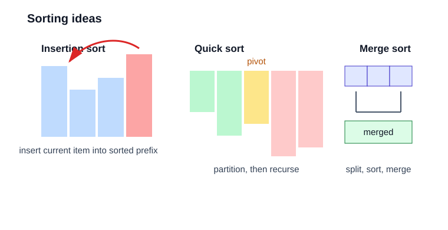

# 排序 / 设计

这一组题更像“把数据结构串起来用”。



## 75. Sort Colors

题目描述：给定只包含 0、1、2 的数组，对它原地排序。

示意：把数组分成 `0 区 / 扫描区 / 2 区` 三段。

关键点：值域很小，没必要用通用排序算法，三指针就能做完。

思路：荷兰国旗问题。三个指针分别维护 0 区、扫描区、2 区。

复杂度：时间 `O(n)`，空间 `O(1)`。

```cpp
class Solution {
public:
    void sortColors(vector<int>& nums) {
        int l = 0, i = 0, r = (int)nums.size() - 1;
        while (i <= r) {
            if (nums[i] == 0) swap(nums[l++], nums[i++]);
            else if (nums[i] == 2) swap(nums[i], nums[r--]);
            else ++i;
        }
    }
};
```

## 56. Merge Intervals

题目描述：给定若干区间，把所有重叠的区间合并。

示意：`[1,3]` 和 `[2,6]` 重叠，所以合成 `[1,6]`。

关键点：先排序，再线性扫描，重叠就合并，不重叠就开新段。

思路：先按左端点排序，再线性扫描合并。

复杂度：时间 `O(n log n)`。

```cpp
class Solution {
public:
    vector<vector<int>> merge(vector<vector<int>>& intervals) {
        sort(intervals.begin(), intervals.end());
        vector<vector<int>> ans;
        for (auto& cur : intervals) {
            if (ans.empty() || ans.back()[1] < cur[0]) ans.push_back(cur);
            else ans.back()[1] = max(ans.back()[1], cur[1]);
        }
        return ans;
    }
};
```

## 57. Insert Interval

题目描述：在一个已经按起点排序且互不重叠的区间集合中插入一个新区间，并保持结果依然有序且不重叠。

示意：先跳过左边不相交的区间，再合并中间重叠区间。

关键点：插入后只会影响插入点附近的区间。

思路：先处理左侧不相交区间，再合并重叠区间，最后追加右侧区间。

复杂度：时间 `O(n)`。

```cpp
class Solution {
public:
    vector<vector<int>> insert(vector<vector<int>>& intervals, vector<int>& newInterval) {
        vector<vector<int>> ans;
        int i = 0, n = intervals.size();
        while (i < n && intervals[i][1] < newInterval[0]) ans.push_back(intervals[i++]);
        while (i < n && intervals[i][0] <= newInterval[1]) {
            newInterval[0] = min(newInterval[0], intervals[i][0]);
            newInterval[1] = max(newInterval[1], intervals[i][1]);
            ++i;
        }
        ans.push_back(newInterval);
        while (i < n) ans.push_back(intervals[i++]);
        return ans;
    }
};
```

## 347 的进阶：用桶排序思路做 Top K

题目描述：不用堆的情况下，如何求前 k 个高频元素。

示意：`freq -> bucket[freq]`

关键点：频率本身可以作为桶下标，直接从高频桶往低频桶扫。

思路：频次是数组下标，所有值按频次放桶里，从高频到低频扫描。

复杂度：时间 `O(n)`，空间 `O(n)`。

```cpp
class Solution {
public:
    vector<int> topKFrequent(vector<int>& nums, int k) {
        unordered_map<int, int> cnt;
        for (int x : nums) ++cnt[x];
        vector<vector<int>> bucket(nums.size() + 1);
        for (auto& [x, c] : cnt) bucket[c].push_back(x);
        vector<int> ans;
        for (int i = (int)bucket.size() - 1; i >= 0 && (int)ans.size() < k; --i) {
            for (int x : bucket[i]) {
                ans.push_back(x);
                if ((int)ans.size() == k) break;
            }
        }
        return ans;
    }
};
```

## 146. LRU Cache

题目描述：设计一个支持 `get` 和 `put` 的缓存结构，容量满时淘汰最近最少使用的元素。

示意：`map` 负责查找，`list` 负责顺序。

关键点：必须同时解决“快速查找”和“快速移动到最近使用位置”两个问题。

思路：哈希表定位节点，双向链表维护最近使用顺序。访问就把节点挪到头部，容量满时删除尾部。

复杂度：所有核心操作 `O(1)`。

```cpp
class LRUCache {
    int cap;
    list<pair<int,int>> lst;
    unordered_map<int, list<pair<int,int>>::iterator> mp;
public:
    LRUCache(int capacity) : cap(capacity) {}

    int get(int key) {
        auto it = mp.find(key);
        if (it == mp.end()) return -1;
        lst.splice(lst.begin(), lst, it->second);
        return it->second->second;
    }

    void put(int key, int value) {
        auto it = mp.find(key);
        if (it != mp.end()) {
            it->second->second = value;
            lst.splice(lst.begin(), lst, it->second);
            return;
        }
        if ((int)lst.size() == cap) {
            mp.erase(lst.back().first);
            lst.pop_back();
        }
        lst.push_front({key, value});
        mp[key] = lst.begin();
    }
};
```
